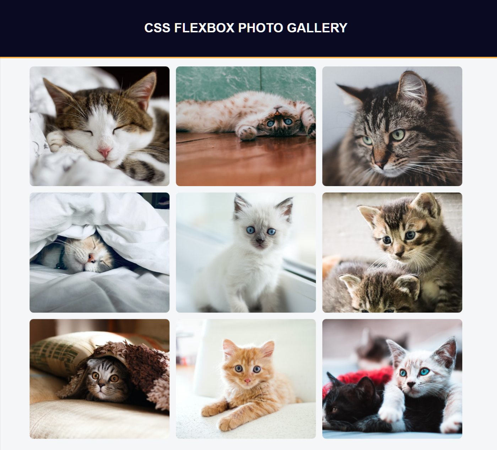

# FreeCodeCamp - Responsive Web Design Certification - Photo Gallery
Project #007

Follow this link for assignment
[Photo Gallery by freeCodeCamp](https://www.freecodecamp.org/learn/2022/responsive-web-design/#learn-css-flexbox-by-building-a-photo-gallery)
                                      
### My notes
Nothing fancy, html, css, Flexbox basics  

